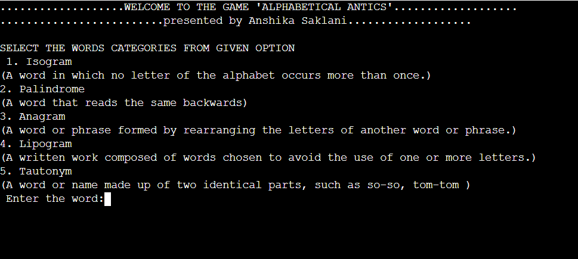

# ALPHABETICAL ANTICS  
A word game designed to challenge and entertain in C

    

# RULES TO BE FOLLOWED  
* Run the program in a C compiler or IDE.  
* Input any word to test its properties within the chosen category.  
# USAGE   

1.  **Select** **a** **Category**: Choose from five word categories - Isogram, Palindrome, Anagram, Lipogram, or Tautonym.

2.  **Enter** **a** **Word**: Input any word you want to analyze.

3.  **Discover** **Word** **Properties**: The program checks the word against the selected category and provides instant feedback on whether it fits the criteria.

4.  **Repeat** **or** **Exit**: Choose to continue exploring different words and categories or exit the game whenever you're ready.

5.  **Challenge** **Yourself**: Test your linguistic knowledge and have fun while exploring the fascinating world of words!  

# FILE  
* main.c: Contains the source code for this particular word game.
* README.md: This file, providing information about the project.  

**CONTACT**   
* Email : anshikasaklani894@gmail.com
* linkedIn : www.linkedin.com/in/
anshika-saklani-77a5a626a

